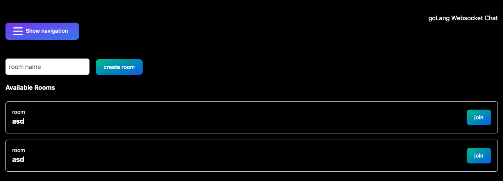
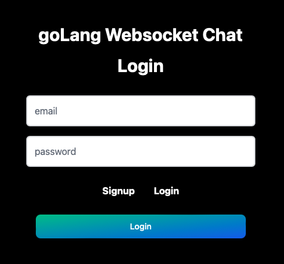

# Golang xWebsocket Chat



## Content

- [Description](#description)
- [Features](#freatures)
- [Architecture](#architecture)
    - [Frontend](#frontend)
    - [Backend](#backend)
    - [Database](#database)
- [Getting started](#getting-started)
- [Contributing](#contributing)
- [Authors](#authors)
- [License](#license)


This project is based on the tutorial [Building a WebSocket Chat App](https://medium.com/@parvjn616/building-a-websocket-chat-application-in-go-388fff758575).


## Description

A small Web Chat Application

This project implements a WebSocket chat application using the Go programming language. 
It allows users to communicate with each other in real-time through a web interface.

## Features 

- GoLang WebSocket communication for real-time messaging
<!-- - Integration with the [Air](#air) framework for live reloading during development -->
- Frontend styling with [Tailwind CSS](https://tailwindcss.com)

<!-- [Air - Live reload for Go apps](https://github.com/cosmtrek/air)

### Air

    go install github.com/cosmtrek/air@latest

For less typing, you could add alias air='~/.air' to your .bashrc or .zshrc.

First enter into your project

    cd /server/cmd

run with ```air``` -->


## Architecture

### Backend
- Golang
    - WebSocket

### Frontend
- HTML, TSX & Tailwindx

### Database
- PostgreSQL

<br>
<br>

# Run Project

!!! Make sure docker daemon is running for DB !!!

## Set up DB with Makefile in ./server

### Init DB

```make postgresinit```

### Enter DB

```make postgres```
 
### Create DB

```make createdb```

### Drop DB

```make dropdb```

### migrateDB
```make migrationup```

```make migrationdown```


### Run Server 
- Go to ./server/cmd and run with ```go run main.go```

### Run Client

- Go to ./client and run with ```npm run dev```


<!-- Run with:
```docker compose up``` -->

<!-- 1. Clone the repository: `git clone https://github.com/your-username/your-repo.git`
2. Install the required dependencies: `go get -d ./...`
3. Run the application: `go run main.go`
4. Open your web browser and navigate to `http://localhost:8080` -->

## Contributing

Contributions are welcome! If you find any issues or have suggestions for improvement, please open an issue or submit a pull request.

## Authors

- Julian Ruben Kolsch 
- Lennart Reinke

## License

This project is licensed under the [MIT License](LICENSE).